---
header:
  icon: /images/nooblyjs-logo-colour.png
  title: NooblyJS Wiki
  links:  [ Go to the wiki](/applications/wiki)  [Overview](#find-anything-understand-everything) [First-time setup](#setting-up-your-repository) [The four views](#finding-your-way-around) [The interface](#the-interface-up-close) [Editing files](#editing-a-file-four-ways)
---

  

# NooblyJS Wiki - Find anything. Understand everything.

The NooblyJS Wiki is the home for everything your teams know — every space, folder, document and diagram in one searchable place, with an AI assistant that answers in plain language and always shows its sources. This guide walks you through your first sign-in, then the four ways to get around.

[badge:success Part one]

## Setting up your repository

The first time you sign in, a short six-step setup makes the repository feel like yours. It takes about a minute — and you can skip it or change everything later. Nothing here is locked in.

container

  left

  #### Step 1 of 6 · Welcome

  ### Welcome aboard

  Your landing pad. The repository says hello and shows what's already waiting for you — a live count of documents, the spaces you can reach, and a handful of folders it suggests for your team.

  ##### On this screen

  - A snapshot of the library — documents, active spaces and suggested folders.
  - **Let's go** starts the walkthrough.
  - **Skip setup** sits top-right on every step, if you'd rather explore first and tailor later.

  right

  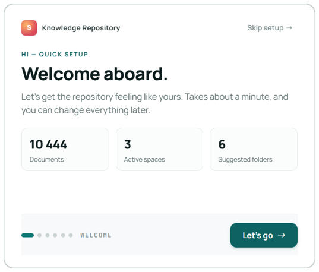

container

  left

  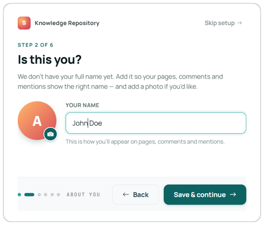

  right

  #### Step 2 of 6 · About you

  ### Tell us who you are

  Your name travels with everything you touch — the pages you create, the comments you leave, the people you mention. This step makes sure it shows up right.

  ##### On this screen

  - Type your full name in **Your name** — the line beneath shows exactly how you'll appear.
  - Optional: add a photo with the camera button on your avatar.
  - **Save & continue** to keep going, or **Back** to revisit the welcome.

container

  left

  #### Step 3 of 6 · Your stuff

  ### Pick the folders you work in

  Tell the repository where you spend your time and it pins those folders to your home screen — so the content you reach for is always one click away.

  ##### On this screen

  - Search for any folder by name in the bar up top.
  - Or tap a **Suggested** folder — Engineering, Product, Operations and more.
  - Choices appear as green chips and the counter tracks how many you've picked. Remove one with its ×.

  right

  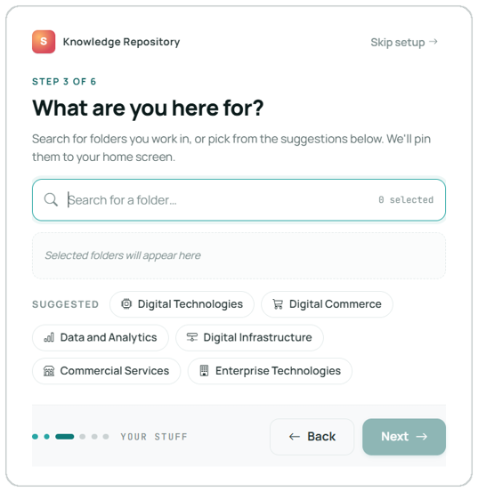

container

  left

  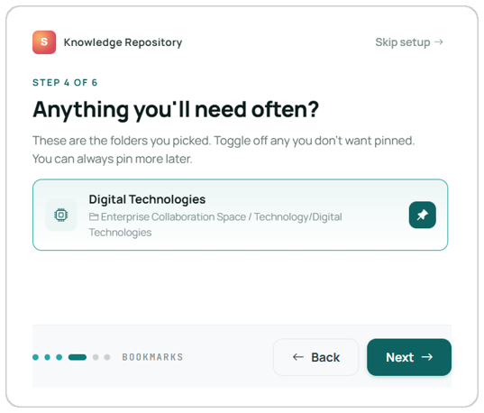

  right

  #### Step 4 of 6 · Bookmarks

  ### Confirm what gets pinned

  A quick review of the folders you just chose. Keep the ones you want on your home screen, toggle off the rest — and pin more whenever you like.

  ##### On this screen

  - Each folder shows its full path, so you know exactly which one it is.
  - Use the **pin toggle** on the right to keep it or drop it.
  - **Next** when you're happy, **Back** to change your picks.

container

  left

  #### Step 5 of 6 · Your view

  ### Choose how you like to work

  This sets your default home — the first thing you see when you open the repository. Pick the one that fits how you think; you can switch anytime from the top bar.

  ##### The four homes

  - **Detailed** — the full tree; every space, folder, panel and stat in one dense view. For solution architects and engineers.
  - **Content** — a magazine of spaces and documents, assistant on hand. For readers and new joiners.
  - **Chat** — ask in plain language, get grounded answers with sources attached. For execs and heads of department.
  - **Search** — begin at the search bar, filter fast, scan results at a glance. For product managers and execs.

  right

  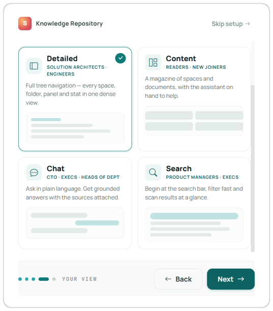

container

  left

  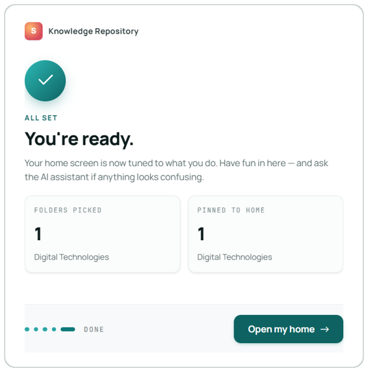

  right

  #### Step 6 of 6 · Done

  ### You're all set

  A tidy recap of your choices. The repository confirms your default view, how many folders you pinned, and the name you'll go by — then opens the door.

  ##### On this screen

  - Three cards recap your **view**, what's **pinned**, and your **profile** name.
  - **Enter repository** jumps straight to your new home.
  - Prefer a guided look? **Take a tour** first.

---

[badge:success Part two]

## Finding your way around

However you set things up, the same four views are always a click away from the top bar. Here's what each one is best at.

container

  left

  #### Detailed view

  ### Everything, in one dense workspace

  The power-user home. A space header up top, your pinned items, and the full folder tree down the left — with the AI assistant docked on the right, ready whenever you need it.

  ##### Key areas

  - **Left sidebar** — shortcuts, your files, and every space you can reach.
  - **Space header** — what the space holds, plus live counts: documents, spaces, recently visited, starred.
  - **Pinned** — the items you bookmarked in setup, with full paths and dates.
  - **Browse** — drill through folders as a List, Grid or Cards.
  - **AI Assistant** — find a document, summarise the space, or have a diagram explained.

  right

  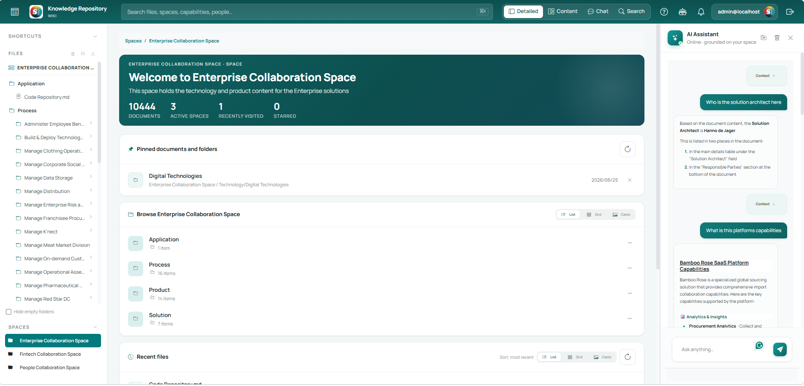

container

  left

  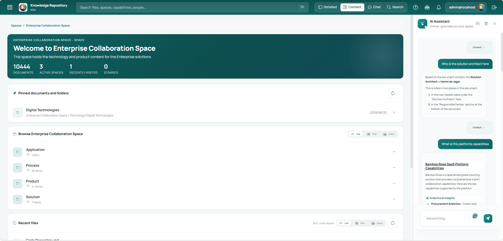

  right

  #### Content view

  ### Browse the library like a magazine

  A calmer, reading-first home. A featured document leads, recently-updated cards follow, and the assistant sits on the left with suggested questions to get you moving.

  ##### Key areas

  - **Featured** — the most-visited document this week, front and centre.
  - **Recently updated** — fresh cards, each tagged by type, space and read time.
  - **Assistant rail** — *Try asking* prompts, plus *Jump back in* shortcuts to where you left off.
  - **List / Grid / Cards** — switch the density to suit your eye.

container

  left

  #### Chat view

  ### Just ask

  When you'd rather ask than browse. Pose a question in plain language and the assistant answers from documents you can access — always with the sources it used, so you can check the original.

  ##### Key areas

  - **Conversation** — your question, then a clear answer with the key facts pulled out.
  - **Sources** — every answer links the documents behind it, each with a match score.
  - **Grounded badge** — shows which space the answer drew on, and how many sources.
  - **History & New chat** — past conversations down the left; start fresh anytime.
  - Always check the linked source — the assistant points you to the truth, it doesn't replace it.

  right

  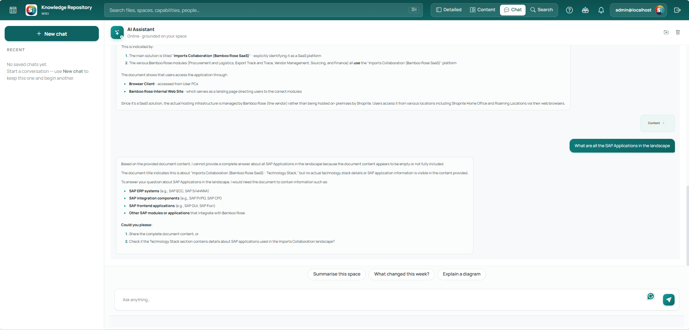

container

  left

  #### Search view

  ### Start typing, scan the results

  The fastest way in when you already know what you're after. Begin at the search bar — across files, spaces, capabilities and people — then filter and scan results at a glance.

  ##### Key areas

  - **One search bar** for files, spaces, capabilities and people — reach it with ⌘K from anywhere.
  - **Filters** to narrow by type, space or owner.
  - **Result rows** you can scan quickly and open in place.

  right

   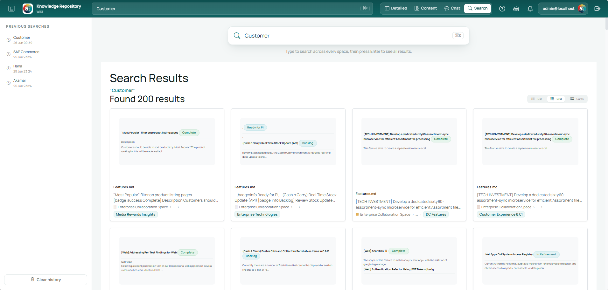

---

[badge:success Part three]

## The interface, up close

Once you're in, two rails frame your reading: navigation down the left, the assistant on the right, and your document in the middle. Here's how to move through it all.

container

  left

  #### The left rail

  ### Everything you can reach, down one side

  The left rail is your map. It stays with you across every view — shortcuts up top, the file tree for wherever you are, an outline of the page you're reading, and the spaces you can switch between at the bottom.

  ##### What's in it

  - **Shortcuts** — Home, Recent, Starred and Templates, one click from anywhere.
  - **Files** — the folder tree for the space you're in. Expand folders, open documents, and use the buttons up top to add a file, add a folder or upload. **Hide empty folders** tidies the view.
  - **On this page** — a live outline of the document you're reading; jump straight to any heading.
  - **Spaces** — switch between collaboration spaces; the active one stays highlighted.

  right

  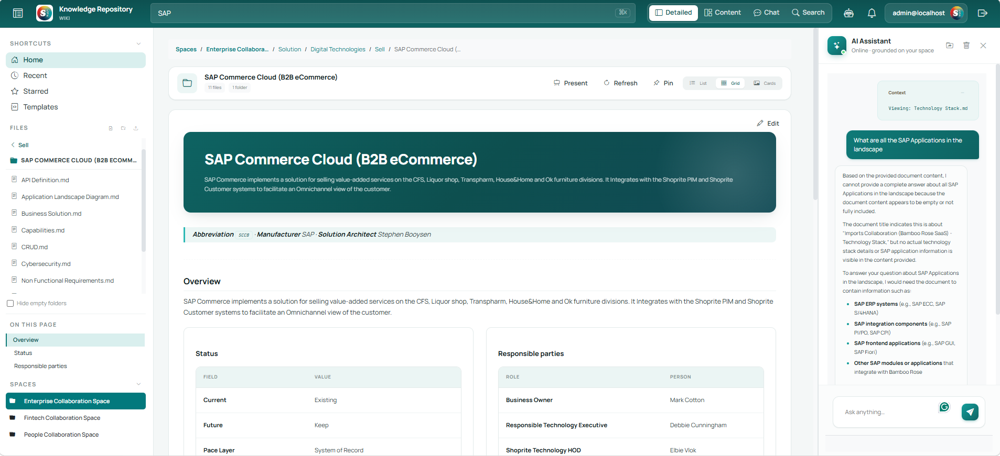

container

  left

  #### ★ Starred

  Mark any document with the **Star** in its header and it lands here — a personal shelf for the pages you return to most.

  right

  #### ↺ Recent

  Retraces your steps to the documents you opened last — no need to remember where something lived to get back to it.

container

  left

  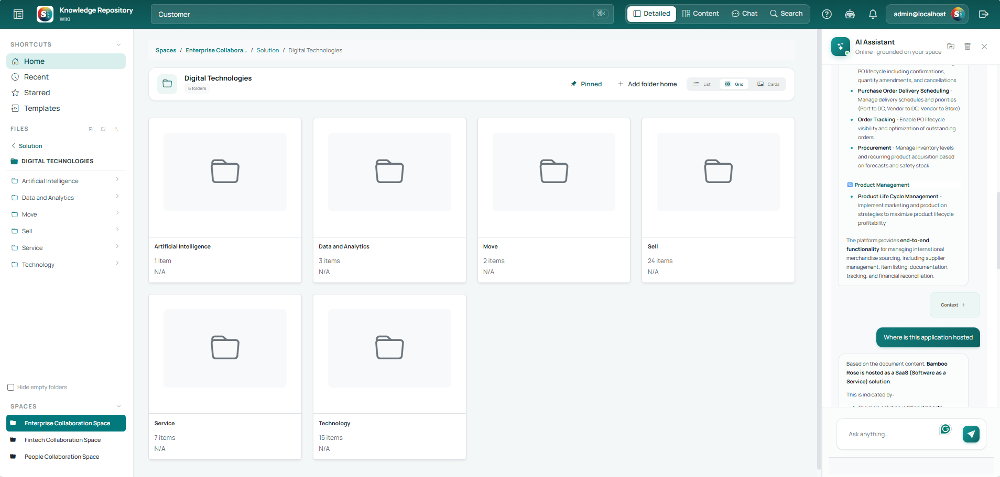

  right

  #### List · Grid · Cards

  ### Browse folders the way that suits you

  Open any folder and the toolbar lets you switch how its contents are laid out — alongside **Present**, **Refresh** and **Pin** for the folder itself. Pick the density that fits what you're doing.

  ##### Three layouts

  - **List** — compact rows; the most items on screen, best for scanning names and counts.
  - **Grid** — roomy tiles, good for recognising content at a glance.
  - **Cards** — the richest layout; each card previews a document's opening content, type and size, so you can judge a file before opening it.

---

[badge:success Part four]

## Editing a file, four ways

Open any document and it fills the page with its own toolbar. Above it sit four tabs — the same content, shown four different ways to read, write and reshape it. Everything you type saves on its own; the corner shows the last save time.

##### Every open file shares one header

[badge:light 📌 Pin] [badge:light ★ Star] [badge:light 🔔 Subscribe] [badge:light Request review] [badge:light 🔗 Copy link] [badge:light ⬇ Download]

cards

  across: 2
  - ### Content
    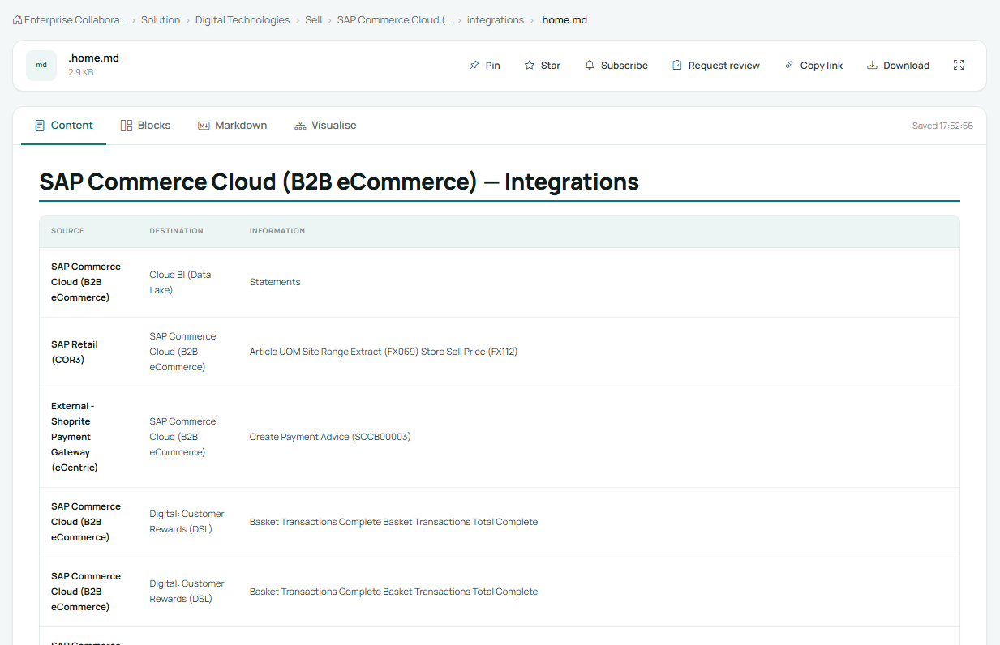

    **Read** · The clean, rendered reading view — headings, tables and text exactly as everyone else sees them.
  - ### Blocks
    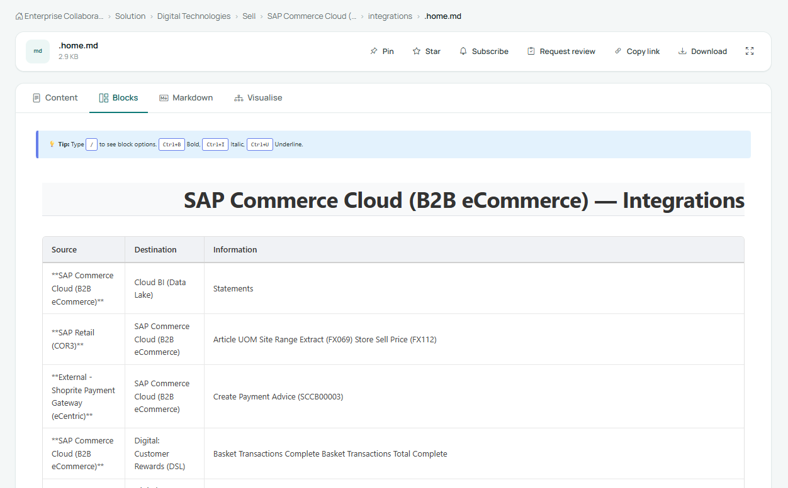

    **Write** · A structured editor. Type **/** for block options and use **Ctrl+B / I / U** to format — build the page block by block.
  - ### Markdown
    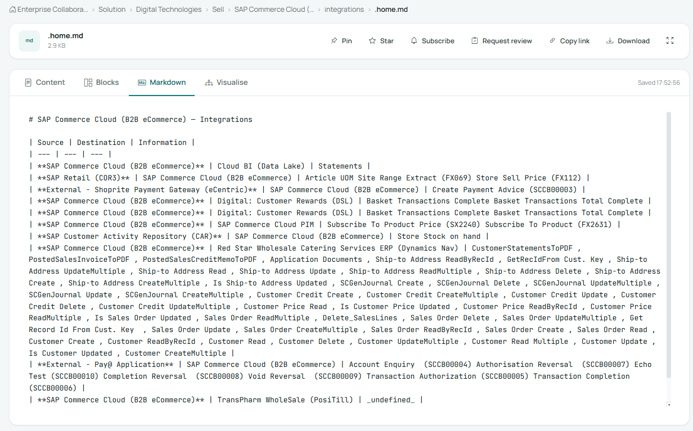

    **Source** · The raw source, for anyone who'd rather write — or paste — plain Markdown directly.
  - ### Visualise
    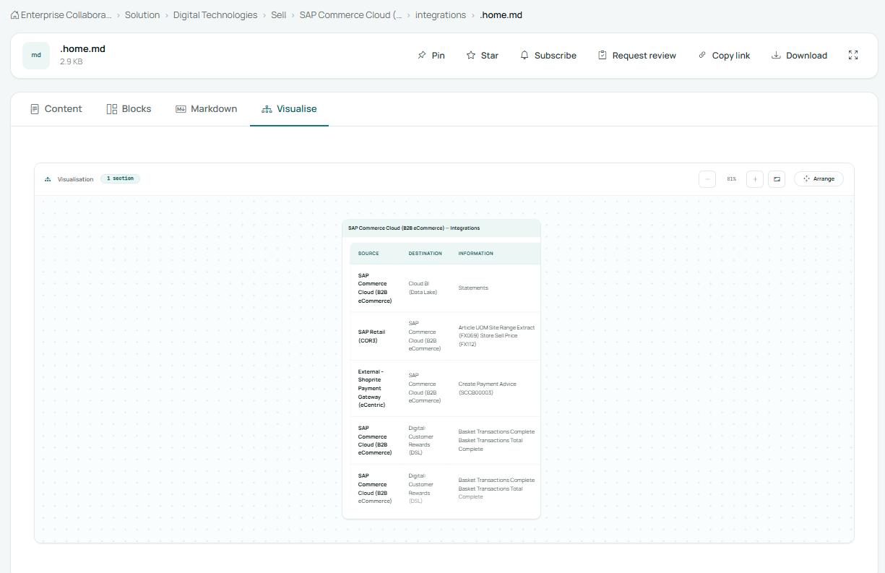

    **Explore** · The page laid out on an open canvas you can zoom and **Arrange** — handy for seeing tables and diagrams in space.

hero-banner:
  title: Nothing here is permanent.
  subtitle: Switch views from the top bar, re-pin folders from any space, and update your name in your profile — anytime. Change your mind as often as you like.

---

footer:
  icon: /images/nooblyjs-logo-colour.png
  title: NooblyJS Wiki
  subtitle: Change our world with Knowledge
  links: [Want to play with the code? Hosted on GitHub](https://github.com/nooblyjs/nooblyjs-apps-wiki)
